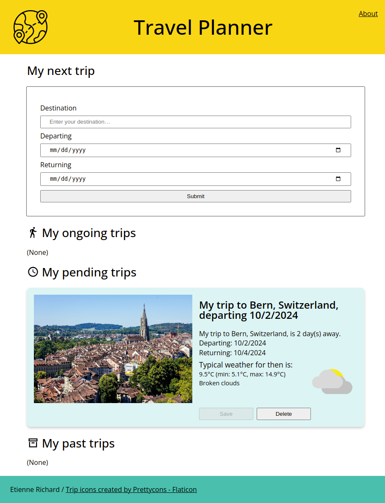

# Capstone Project — Travel App

This repository contains the code for the Capstone Project — _Travel App_ of the Udacity Nanodegree
Front End Web Developer (2023-2024).

**ⓘ Note:** There was no starter project for this project.

Content:

- [1. Quick Start](#quick-start)
  - Prerequisites
  - Installation and configuration
    - Frontend
    - Backend
  - Running in development
  - Running in production
- [2. Developing](#developing)
  - Running the tests
    - Frontend
    - Backend
  - Formatting the code
    - Frontend
    - Backend
  - Linting the code
    - Frontend
    - Backend
- [3. Design notes](#design-notes)
- [4. Sources and assets](#sources-and-assets)
- [5. Additional references](#additional-references)
- [6. Tools used](#tools-used)
- [7. How to use Dev Containers](#how-to-use-dev-containers)

<a id="quick-start"></a>

## 1. Quick Start

Instead of having a single mixed project, we decided to split the project into 2 sub-projects,
_frontend_ and _backend_, with their own set of dependencies (and thus their own *package.json*).

Here is a screenshot of the front-end.



### Prerequisites

This project makes use of 3 external services. You will need to sign-up and have credentials for each
of them.

**GeoNames:**
- [GeoNames](https://geonames.org) is a comprehensive geographical database that provides information
  on millions of places worldwide, including cities, regions, and natural features. It offers a range
  of APIs, such as search, reverse geocoding, and postal code lookups.
- You can create an account [here](http://www.geonames.org/login).
- We use the [GeoNames Search API](https://www.geonames.org/export/geonames-search.html) to find the
  destination entered by the user.

**WeatherBit:**
- [WeatherBit](https://www.weatherbit.io/) provides a comprehensive suite of real-time, historical,
  and forecast weather data globally, offering detailed meteorological information like temperature,
  precipitation, and air quality. Those data are accessible through a range of APIs.
- You can create an account [here](https://www.weatherbit.io/account/create).
- We use the [Current Weather API](https://www.weatherbit.io/api/weather-current) to get the current
  weather at the destination, and the [Weather Forecast API](https://www.weatherbit.io/api/weather-
  forecast-api) to get the weather forecast at the destination (note that we get only 7 days in the
  future with the Free plan).

**Pixabay:**
- [Pixabay](https://pixabay.com/) offers a vast library of free, high-quality images, videos, and
  illustrations, allowing users to search, download, and integrate royalty-free media into their
  projects. An API provides free access to that library, with options for advanced search and
  filters.
- You can create an account by clicking the _Join_ button on the landing page.
- The documentation for the API is [here](https://pixabay.com/service/about/api/).

Moreover, this project is built with [Node.js](https://nodejs.org/) (version 20) and managed with 
`npm`. For convenience, it was developed using [Development Containers](https://containers.dev/),
but this is not a hard requirement. Any local installation of a suitable version of Node (e.g., with
[nvm](https://github.com/nvm-sh/nvm)) should work. See also 
[7. How to use Dev Containers](#how-to-use-dev-containers).

### Installation and configuration

**🛈 Note:** For the sake of brevity, we assume that _Shell 1_ is always at the root of the
_frontend_ sub-project:
```bash
# Shell 1
cd frontend
```
And that Shell 2 is always at the root of the backend sub-project:
```bash
# Shell 2
cd backend
```

#### Frontend

Open a shell and install the dependencies:
```bash
# Shell 1.
npm install
```

#### Backend

Open a shell and install the dependencies:
```bash
# Shell 2.
npm install
```

Configure the backend:

- Create a _.env_ file (mind the leading dot).
- Edit the file to add the credentials for the 3 services mentioned above:
  ```shell
  GEONAMES_USERNAME=<your-geonames-username>
  WEATHERBIT_API_KEY=<your-weatherbit-api-key>
  PIXABAY_API_KEY=<your-pixabay-api-key>
  ```

### Running in development

**Option 1.** Run the project using the
[Webpack Development Server](https://webpack.js.org/configuration/dev-server/):

- Open a shell and start serving the front-end with the Webpack Development Server:
  ```bash
  # Shell 1.
  npm run serve:dev
  ```

- Open a shell and start the back-end in development mode:
  ```bash
  # Shell 2.
  npm run start:dev
  ```

- Open a browser and navigate to http://localhost:8080/ (this should be automatic if you are using
  Visual Studio Code).

This option is best suited for quick development as changes are immediately reflected in the UI
thanks to Hot Module Reloading (HMR).

**Option 2.** Run the project using the back-end to serve a full development build:

- Open a shell, make a development build and start the back-end:
  ```bash
  # Shell 1.
  npm run build:dev
  ```
- Open a shell and start the back-end in development mode:
  ```bash
  # Shell 2.
  npm run start:dev
  ```
- Open a browser and navigate to http://localhost:3000/ (this should be automatic if you are using
  Visual Studio Code).

### Running in production

Run the project using the back-end to serve a full production build:

- Open a shell, make a production build and start the back-end:
  ```bash
  # Shell 1.
  npm run build:prod
  ```
- Open a shell and start the back-end in production mode:
  ```bash
  # Shell 2.
  npm run start:prod
  ```
- Open a browser and navigate to http://localhost:3000/ (this should be automatic if you are using
  Visual Studio Code).

<a id="developing"></a>

## 2. Developing

### Running the tests

#### Frontend

The units tests use [Jest](https://jestjs.io/) with a few add-ons (`jest-environment-jsdom` and `jest-fetch-mock`). 

To run the tests, open a shell and run:
```bash
# Shell 1.
npm run test
```

#### Backend

The units tests use [Jest](https://jestjs.io/) with a few add-ons (`jest-fetch-mock`) as well as `supertest`.

To run the tests, open a shell and run:
```bash
# Shell 2.
npm run test
```

### Formatting the code

We use [Prettier](https://prettier.io/) for formatting most files:

- See the [_.prettierrc_](./.prettierrc) file at the root of the project.

#### Frontend

To format files:
```bash
# Shell 1.
./reformat.sh
```

That little script also restores the `<!DOCTYPE html>` to uppercase (see [issue 15476](https://github.com/prettier/prettier/issues/15476) for details).

**🛈 Note:** We use the
[prettier-plugin-organize-attributes](https://www.npmjs.com/package/prettier-plugin-organize-attributes)
plug-in to automatically reorder the attributes of HTML elements.

We use [Stylelint](https://stylelint.io/) for formatting styles sheets (_\*.css_, _\*.scss_ and
_\*.sass_ files):

- See the [_.stylelintrc.json_](./frontend/.stylelintrc.json) file at the root of the _frontend_ sub-project.
- To format style sheets:
  ```bash
  # Shell 1.
  npx stylelint --fix "./src/styles/*.{css,scss,sass}"
  # Or:
  DEBUG=stylelint:* npx stylelint --fix "./src/styles/*.{css,scss,sass}"
  ```

**🛈 Note:** We use the
[stylelint-config-idiomatic-order ](https://github.com/ream88/stylelint-config-idiomatic-order)
plug-in to automatically reorder CSS properties according to
[Principles of writing consistent, idiomatic CSS](https://github.com/necolas/idiomatic-css#declaration-order), plus a few other plug-ins.

#### Backend

To format files:
```bash
# Shell 2.
npx prettier --write .
```

### Linting the code

We use [ESLint](https://marketplace.visualstudio.com/items?itemName=dbaeumer.vscode-eslint) for
linting _\*.js_ and _\*.mjs_ files.

Moreover, since Visual Studio Code comes with language support for JavaScript and TypeScript. We put
`// @ts-check` at the top of all JavaScript files to benefit from the power of the TypeScript
compiler. See
[_JS Projects Utilizing TypeScript_](https://www.typescriptlang.org/docs/handbook/intro-to-js-ts.html).
In summary, all source _\*.js_ and _\*.mjs_ files should start with:

```javascript
// @ts-check
'use strict';
```

<a id="design-notes"></a>

## 3. Design notes

### Front-end

As mentioned above, the front-end is a single page application (SPA). It allows the user to create a
new trip based on:
- A destination.
- A date of departure.
- A date of return.

The trips are listed under 3 categories:
- Ongoing
- Pending
- Past

The _Ongoing_ and _Pending_ categories are sorted in chronological order while the _Past_ category
is sorted in reverse chronological order.

#### Flows

Loading all trips:

- When the frontend loads, it connects to the backend's `/trips` endpoint to GET all trips currently
  stored in the backend.

Searching for a destination:

- The front-end first connects to the backend's `/search/destination` endpoint, that uses the
  GeoNames Search API to do geo-coding. The destination entered by the user is treated as a query
  and resolved to a place-name, country-name and (lon, lat) coordinates. If an error occurs (e.g.,
  if the destination cannot be found), we display an error and the flow stops.

- The front-end then connects to the backend's `/search/weather` endpoint, that uses the WeatherBit
  API to get the weather at the (lon, lat) coordinates. If the trip is at most 1 day in the future,
  we use the Current Weather API. Otherwise, we use the Weather Forecast API. Note that we get only
  7 days in the future with the Free plan. So even if the trip is planned more than 7 days in the 
  future, we still use the 7-day forecast. If an error occurs (e.g., if no forecast is available),
  we display an error and the flow stops.

- The front-end finally connects to the backend's `/search/picture` API endpoint, that uses the 
  Pixabay API to find a picture for the destination, using "&lt;place-name&gt; &lt;country-name&gt;"
  as query. If an error occurs (i.e., if no picture is available), we simply display a place-holder.

- The resulting trip is shown in the UI in the _Pending_ category. Note that the trip is in draft
  state and **not saved, yet**.

Saving a trip:

- The frontend connects to the backend's `/trips` endpoint and POSTs the new trip.
- If an error occurs, we display an error.

Deleting a trip:

- The frontend connects to our `/trips/:tripId` endpoint to DELETE an existing trip.
- If an error occurs, we display an error.

#### Handling errors

We try to handle the following classes of errors:

- Invalid user input (e.g., date in the past, date too far in the future, etc.).
- Network issues. One measure is to have strict timeouts on all `fetch()` calls using an
  `AbortController` and `setTimeout()`.
- Errors reported by the back-end (client errors, internal errors, etc.).

#### Implementation

Implementation:

- The front-end is implemented as a hand-rolled single page application (SPA).
- The project is managed and bundled with [Webpack 5](https://webpack.js.org/). Common settings are
  factored out in a separate _webpack.common.mjs_. The setup is based on the free
  [Webpack 5 Fundamentals](https://www.udemy.com/course/webpack-5-fundamentals/) tutorial by Robert
  Guss.
- Styles are managed with [Sass](https://sass-lang.com/).
- The front-end is turned into a
  [Progressive Web Application](https://webpack.js.org/guides/progressive-web-application/) (PWA) by
  adding Service Workers (SW) with [Workbox](https://github.com/GoogleChrome/workbox).
- We use features of the latest version of JavaScript (ECMAScript) and Babel with
  [@babel/preset-env](https://babeljs.io/docs/babel-preset-env) to transpile to an older version.
- We use [ECMAScript Modules](https://nodejs.org/docs/latest-v20.x/api/esm.html) (ESM) instead of
  [CommonJS Modules](https://nodejs.org/docs/latest-v20.x/api/modules.html) (CJS).

Other notes:
- As images returned by the Pixabay API can have different aspect ratios, we use the CSS rules
  below. An alternative would have been to resize while keeping the aspect ration and then to pad
  the picture, resulting in a pair of vertical or horizontal "bands" around the picture (whose color
  could be fixed or use the "average" color of the picture).
  ```css
  img {
    width: 100%;
    height: 100%;
    /* Preserve aspect ratio while fitting inside the container. */
    object-fit: cover;
    /* Center the image within the container. */
    object-position: center;
  }
  ```

Tests:

- Units tests use [Jest](https://jestjs.io/).
- We use a few additional modules:
  - https://www.npmjs.com/package/jest-fetch-mock for testing functions that make use of `fetch()`
    calls.
  - https://www.npmjs.com/package/jest-environment-jsdom for testing function that update the DOM.

#### What could be improved

User experience:
- Allow the user to specify the country.
- Instead of directly displaying a trip based on the best search result, display the search results
  on a separate page and let the user choose. This reference could be useful:
  - [Build a custom SPA Router using VanillaJS](https://dev.to/skaytech/build-a-custom-spa-router-using-vanillajs-4a9l),
    Karthik Shivkumar, 2020.

Implementation:
- When we need to add a new trip, we clone a `<template>` element and then adjust the content. We
  could use a real template system instead.
- Once the frontend has collected the needed pieces of information (destination, weather, picture)
  and POSTs the new trip to the `/trips` endpoint, we validate the properties of the object being
  posted, but we do not check that the weather and picture are really for the given destination. A
  malevolent user could e.g., use `curl` to post a trip with inconsistent data. Ideas:
  - The frontend could POST only the destination. The backend would again collect the missing pieces
    of information (weather, picture). The backend could use caching to avoid paying multiple times
    when using metered 3rd party APIs.
  - We could build the draft trip entirely on the backend. This seems to go against the REST
    principles and would require preventing unused draft trips from accumulating (maybe setting a
    maximum number of drafts per user, once authentication has been added).
  - We could define a token that identifies the query (e.g., 
    "&lt;place-name&gt;:&lt;country-name&gt;:&lt;lon/lat&gt;") and pass it to to the following
    `/search` endpoints. A given endpoint would returns the usual piece of information, plus a
    digest of the (token, data) pair. To create a new trip, the frontend would POST the token and
    all pieces of information and their digests. The backend would verify that all pieces of
    information have not been tampered and relate to the same token.
- Refactor the frontend to use an MVC approach. Those references could be useful:
  - [Writing a TodoMVC App with Modern Vanilla JavaScript](https://frontendmasters.com/blog/vanilla-javascript-todomvc/),
    Marc Grabanski, 2022.
  - [How to Build a Simple MVC App From Scratch in JavaScript](https://www.taniarascia.com/javascript-mvc-todo-app/),
    Tania Rascia, 2019.
- Build a better offline experience. This reference could be useful:
  - [Progressive Web Apps (PWA) - The Complete Guide](https://www.udemy.com/course/progressive-web-app-pwa-the-complete-guide/)
    by Maximilian Schwarzmüller.

### The backend

As mentioned above, the back-end is an API. It is responsible for interacting with 3rd party APIs
and for storing the trips in a mock data store.

Here is a brief description of the `search` endpoints:
- `GET /search/destination`: Searches for a destination.
  - Request validation: see [destination-validator.mjs](backend/src/middleware/search/destination-validator.mjs).
  - Response: see `DestinationResult` in [typedefs.mjs](backend/src/types/typedefs.mjs).
  - Implementation: see [destination-service.mjs](backend/src/services/search/destination-service.mjs).
- `GET /search/weather`: Gets the weather for a given location.
  - Request validation: see [weather-validator.mjs](backend/src/middleware/search/weather-validator.mjs).
  - Response: see `WeatherResult` in [typedefs.mjs](backend/src/types/typedefs.mjs).
  - Implementation: see [weather-service.mjs](backend/src/services/search/weather-service.mjs).
- `GET /search/picture`: Finds a picture for a given location.
  - Request validation: see [picture-validator.mjs](backend/src/middleware/search/picture-validator.mjs).
  - Response: see `PictureResult` in [typedefs.mjs](backend/src/types/typedefs.mjs).
  - Implementation: see [picture-service.mjs](backend/src/services/search/picture-service.mjs).

When the backend run in development mode, we add the following endpoints that return canned data:
- `GET /search/test/destination`
- `GET /search/test/weather`
- `GET /search/test/picture`

Here is a brief description of the `trips` endpoints:

- `POST /trips`: Adds a trip to the mock data store.
  - Request validation: see [validate-create-trip.mjs](backend/src/middleware/trips/validate-create-trip.mjs).
  - Response: returns an object of the form `{ "tripId": "<tripId>", "message": "<message>>" }`,
    where the `<tripId>` is the trip ID assigned by the backend.
  - Implementation: see [trips-service.mjs](backend/src/services/trips/trips-service.mjs).
- `GET /trips`: Returns all trips in the mock data store.
  - Request validation: n/a.
  - Response: returns an array of `Trip`; see `Trip` in [typedefs.mjs](backend/src/types/typedefs.mjs).
  - Implementation: see [trips-service.mjs](backend/src/services/trips/trips-service.mjs).
- `DELETE /trips/:tripId`: Removes a trip from the mock data store.
  - Request validation: see [validate-delete-trip.mjs](backend/src/middleware/trips/validate-delete-trip.mjs).
  - Response: returns an object of the form `{ "message": "<message>>" }`.
  - Implementation: see [trips-service.mjs](backend/src/services/trips/trips-service.mjs).

Those basically implement the CRD in CRUD (Create, Read, Update, Delete).

#### Handling errors

We try to handle the following classes of errors:

- Invalid request (e.g., invalid (lon, lat) coordinates).
- Network issues. One measure is to have strict timeouts on all `fetch()` calls using an
  `AbortController` and `setTimeout()`.
- Errors reported by the 3rd party APIS.

#### Implementation

Implementation:

- The back-end is implemented as an [Express.js](https://expressjs.com/) application.
- We use [ECMAScript Modules](https://nodejs.org/docs/latest-v20.x/api/esm.html) (ESM) instead of
  [CommonJS Modules](https://nodejs.org/docs/latest-v20.x/api/modules.html) (CJS).
- We use a few additional modules:
  - [express-validator](https://www.npmjs.com/package/express-validator) to validate requests made
    by clients.
  - [winston](https://www.npmjs.com/package/winston) for logging.

<a id="sources-and-assets"></a>

## 4. Sources and assets

We used the following additional assets:

- PNG-s from [Flaticon](https://www.flaticon.com/) (free for personal and commercial use with
  attribution, see [Flaticon Terms of use](https://www.freepikcompany.com/legal#nav-flaticon) for
  details):

  - [This icon](https://www.flaticon.com/free-icon/world_1127988?term=trip&page=1&position=3&origin=style&related_id=1127988)
    from the [Trip icons created by Prettycons - Flaticon](https://www.flaticon.com/free-icons/trip).  
    Author: Prettycons  
    Use: Logo

- Icons from [Iconify](https://iconify.design/):
  - https://icon-sets.iconify.design/mdi/walk/
  - https://icon-sets.iconify.design/mdi/clock-time-four-outline/
  - https://icon-sets.iconify.design/mdi/archive-outline/

<a id="additional-references"></a>

## 5. Additional references

In addition to the material presented in the course, we used:

- Free [Webpack 5 Fundamentals](https://www.udemy.com/course/webpack-5-fundamentals/) tutorial by
  Robert Guss.

<a id="tools-used"></a>

## 6. Tools used

- [Visual Studio Code](https://code.visualstudio.com/).  
  Use: IDE.  
  **Extensions:**

  - [Dev Containers extension](https://marketplace.visualstudio.com/items?itemName=ms-vscode-remote.remote-containers)  
    Use: Containerized Node setup for local development.

  - [ESLint](https://marketplace.visualstudio.com/items?itemName=dbaeumer.vscode-eslint)  
    Use: Linter for JavaSCript.

- [Prettier](https://prettier.io/) as a local install (not the Visual Studio Code extension).  
  Use: Linter/formatter for JavaScript, HTML and CSS files.  
  **Plugins:**

  - [prettier-plugin-organize-attributes](https://www.npmjs.com/package/prettier-plugin-organize-attributes)  
    Use: Automatically reorder HTML element attributes.

- [Stylelint](https://stylelint.io/) as a local install (not the Visual Studio Code extension).  
   Use: Linter for CSS files.  
   **Plugins:**

  - [stylelint-config-idiomatic-order ](https://github.com/ream88/stylelint-config-idiomatic-order)  
    Use: Automatically reorder CSS properties according to
    [Principles of writing consistent, idiomatic CSS](https://github.com/necolas/idiomatic-css#declaration-order).

- Chrome extensions:

  - [axe DevTools - Web Accessibility Testing](https://chrome.google.com/webstore/detail/axe-devtools-web-accessib/lhdoppojpmngadmnindnejefpokejbdd)  
    Use: Web Accessibility Testing

<a id="how-to-use-dev-containers"></a>

## 7. How to use Dev Containers

To setup the environment:

1. Install Docker and make it possible to manage it as non-root.
2. Create _.devcontainer.json_ (already included in this project):

   ```json
   {
     "image": "mcr.microsoft.com/devcontainers/javascript-node:22-bookworm"
   }
   ```

3. Use the Command Palette: `Dev Containers: Reopen in Container`.
4. Open a terminal inside the container.

To run the project:

1. Refer to the [Quick Start](#quick-start) section above.
2. Run:

   ```bash
   npm run ...  # Or npx ... for a tool.
   ```

3. The extension exposes the port and offers to launch the default browser.
